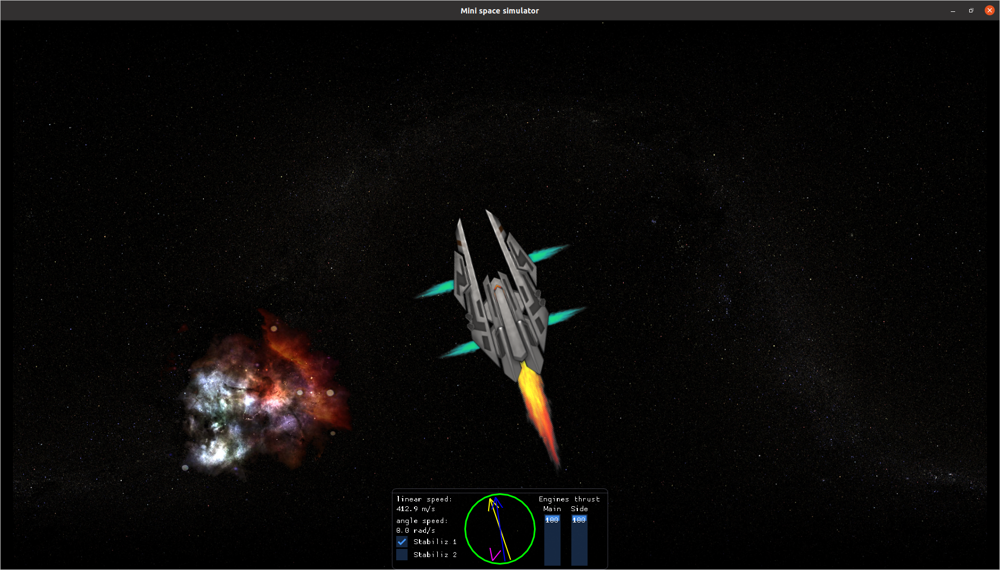
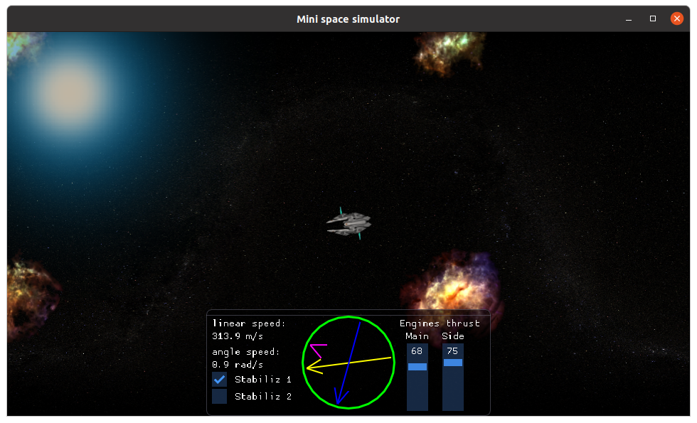
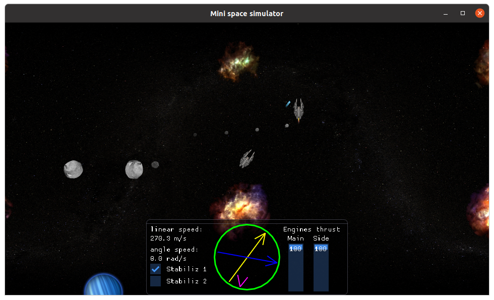
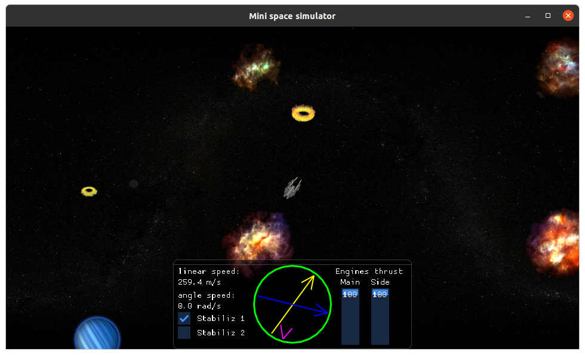

# Mini space simulator
  

Mini space simulator (MSP) - open-source 2D game about traveling in space on rocket. Based on "almost" realistic physics include gravity and physical-based control of the rocket. 
The goal of game is to last as long as you can in virtual world and and enjoy the process=). I hope you will. 
Game contains its own tiny engine based on free components such as SDL2, OpenGL, Dear Imgui.
Project is still in development and any help and ideas about game will be appreciated.

## Controls
Ship control based on physical laws therefore your commands just control enabling and disabling engines. Engines apply some force to rocket and rocket moves. 
In order to survive you should remember that every objects in game have inertion so you can't just stop moving or rotating in one monent.

Keys:

Rocket controls:
- W     - move forward
- A     - rotate left (counterclock-wise)
- D     - rotate right (clockwise)
- SPACE - attack

Game controls:
- mouse wheel rolling - changing scale of view of the game world
- middle mouse button - reset scale to initial value.
- ESC - pause/unpause game

Game control panel:
- Stabiliz 1 - enable stabilization level 1 (double thrust for rotation in order counter to current rotation order)
- Stabiliz 2 - enable stabilization level 2 (auto stabilization)
- Yellow arrow shows current rocket's position
- Blue arrow shows current rocket's motion direction
- Purple arrow shows direction to world center

Note: Game physics imply that planets and stars apply gravity attraction force to every object on map exclude stars (plants attract each others). 
Asteroids and rockets don't attract any objects.

## Supported platforms
- Linux
- Windows
- Android

## Usage
Building and run on Linux:

    cd [repositories-folder]
    git clone https://gitlab.com/kavalchuk.d.v/mini-space-simulator.git
    cd mini-space-simulator
    mkdir build
    cd build
    cmake ..
    cmake --build .
    ./build/game
    
For building on Windows you should use MSVC compiler because mingw doesnt support std::thread.
The most convenient is using [VCPKG](https://github.com/microsoft/vcpkg).

For building for Android you should download source files of SDL2.0.12 and also create and fill the file "local.properties". Using Android studio is recommended.

## Gallery

## Features
- "True" gravity
- Air resistance
- Realistic control
- Hand-made micro-sound mixer with implemented stereo
- Optimized parallax imitation
- Multicontext shaders

## Dependencies
Common:
- CMake 3.16.0+
- SDL2 2.0.12+
- OpenGL ES 3.0+/Core 3.3+
- Dear Imgui v1.77 WIP implemented as source files

Linux:
- Linux kernel 5.3.0+
- GCC 9.3.0+

Android:
- Android 7.0+ (API level 24+)
- Android SDK 30+
- Android NDK 21.0.6113669+

Windows:
Windows 10
MSVC 19.26.28806.0

Note: you are free to try lower version of dependencies, but only listed ones are tested.

## TODO
### Firstly:
- implement enemies logic
- add goal of the game (win conditions)
- fix parallax  imitation bug comes from double/float conversion accurasy loss
- fix android initial bugs (screen position and enabled engines)
- add game menu
- add Android touch control
- add minimap

### Secondary:
- improve collision detection (SAT and etc)
- reimplement sound on OpenAL
- add level designer tool based on ImGui
- add rocket, planet, asteroids, stars types
- add animations for stars, bullets
- light improving (glare above fire of engines and stars)
- add falling stars background
- add healths
- add damage of rocket's parts
- add electric shield for rockets
- add gravitation bombs
- add multiplayer
- add mp3 support
- conduct texture size optimization
- perfomance optimization

## Acknowledgments
There are some people which ones I'd like to thanks for:
- Leanid Chayka     - my teacher, for all my knowledeges about game development
- Mariya Kosacheva  - my schoolmate at gamedev cources, for plenty advices and review
- Kavalchuk Helen   - my awesome wife, for user experince and great amount of creative ideas and certainly for supporting me through whole process of development

The game was designed on gamedev [cources](https://www.it-academy.by/course/c-game-developer/game-developer/).

